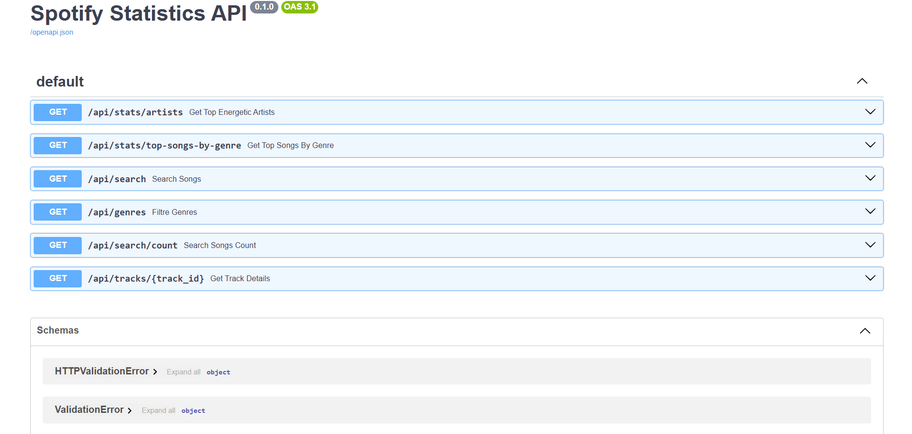

# Spotify Analytics & Data Engineering Explorer (Full-Stack)

An end-to-end full-stack data engineering and analytics project. This repository contains a robust asynchronous ETL pipeline, a RESTful API built with FastAPI, and a highly interactive, beautifully designed Frontend built with Streamlit. The application processes 114,000+ Spotify tracks from a Kaggle CSV dataset into a PostgreSQL database, allowing users to query, visualize, and listen to the "Audio DNA" of tracks dynamically.

## Tech Stack
* **Frontend:** Streamlit, Plotly Express
* **Backend API Framework:** FastAPI & Uvicorn (100% Asynchronous)
* **Database:** PostgreSQL (asyncpg)
* **Data Processing:** Pandas
* **Environment Management:** python-dotenv

## Key Features

### Frontend & UX (User Experience)
* **Interactive Dashboard:** A sleek, dark-themed UI (Spotify Theme) built with Streamlit, completely decoupled from the backend.
* **Audio DNA Radar Chart:** Visualizes complex audio features (Energy, Danceability, Valence, Acousticness, Liveness) dynamically using Plotly's polar line charts.
* **Integrated Spotify Player:** Embeds the official Spotify mini-player directly into the dashboard for immediate audio playback of the selected track.
* **Advanced Pagination & Notifications:** Seamless 10-item data pagination utilizing Streamlit's Session State and modern UI toast notifications for a smooth browsing experience.

### Backend & Data Engineering
* **100% Asynchronous Architecture:** Completely migrated from synchronous DB drivers to `asyncpg`, allowing the API to handle thousands of concurrent requests without blocking.
* **Defensive Programming & Error Handling:** Implemented robust `try-except-finally` blocks and automated database transaction rollbacks across all endpoints to ensure system stability and provide graceful HTTP 500/404 error responses.
* **ETL Pipeline (`data_importer.py`):** Cleans and migrates raw CSV data (114k rows) into a relational PostgreSQL database automatically using async transactions.
* **Advanced SQL Queries:** Utilizes complex SQL operations including `GROUP BY`, `ORDER BY`, and **Window Functions** (`ROW_NUMBER()`, `PARTITION BY`).

## Setup and Installation

### 1. Clone the Repository
git clone https://github.com/irmakoznrgz/spotify-analytics-backend.git
cd spotify-analytics-backend

### 2. Install Dependencies
pip install -r requirements.txt

### 3. Database Configuration (.env)
Create a `.env` file in the root directory and add your PostgreSQL credentials:

DB_HOST=localhost
DB_PORT=5432
DB_NAME=postgres
DB_USER=your_db_username
DB_PASS=your_db_password

### 4. Run the ETL Pipeline (One-Time Setup)
Make sure you have downloaded the dataset from Kaggle and placed it in the `data/` folder.
python data_importer.py

### 5. Start the Application
You will need two terminal windows to run both the backend and frontend simultaneously.

**Terminal 1: Start the Backend (FastAPI)**
uvicorn main:app --reload
*(The API will be available at http://127.0.0.1:8000/docs - Interactive Swagger UI)*

**Terminal 2: Start the Frontend (Streamlit)**
streamlit run frontend.py
*(The application will automatically open in your default browser at http://localhost:8501)*

## API Endpoints

| Method | Endpoint | Description |
| :--- | :--- | :--- |
| `GET` | `/` | Root endpoint, checks API health. |
| `GET` | `/api/stats/artists` | Returns the top 10 most energetic artists. |
| `GET` | `/api/stats/top-songs-by-genre` | Uses Window Functions to return top 3 songs per genre. |
| `GET` | `/api/search` | Dynamic search with 10+ query parameters and pagination support (`limit`, `offset`). |
| `GET` | `/api/search/count` | Returns the total count of tracks matching the active dynamic filters. |
| `GET` | `/api/tracks/{track_id}` | Retrieves all 20 detailed features for a specific single track. |

##  API Documentation (Swagger UI)
Here is a snapshot of the interactive API documentation automatically generated by FastAPI:

